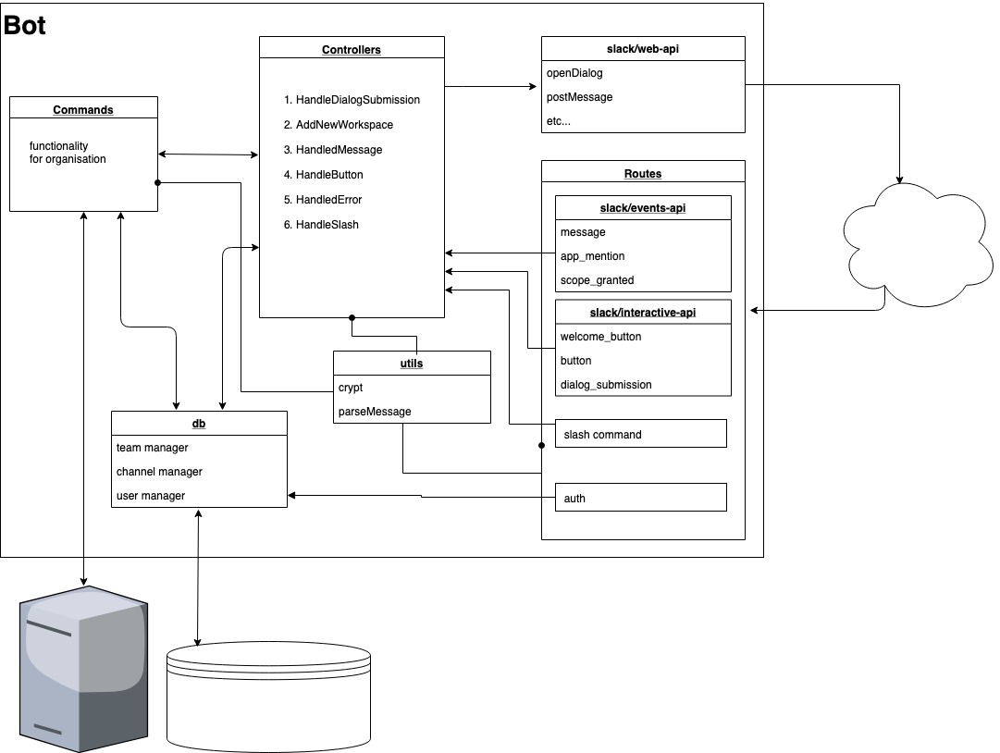

![what a BOT !][logo]

[logo]: https://cdn3.iconfinder.com/data/icons/robots-flat-collection/60/Robots_-_Flat_-_018_-_Bot-128.png

work in progress

# template for building slack bot using slackApi

  - mysql DB for bot support (add/get/remove) teams, channels and users
  - Dockerfile for dev and prod environments
  - using ES modules compiled to CommonJS using babel
  - using localtunnel for testing bot on local environments
  - vscode configuration for debugging local/container


### Installation
fill all fields in the .env file.
Install the dependencies and devDependencies and start the server.

```sh
$ cd slack-bot-template
$ yarn
$ yarn lt
$ yarn watch
```

### install and deploy in a Docker container.
By default, the Docker will expose port 8080, so change this within the docker-compose if necessary.
When ready, simply use the Dockerfile to build the image.

```
yarn docker
```
### basic architecture diagram:



### Todos

 - DB tables migration and functions
 - auth users and workspace
 - fix docker files
 - localtunnel to restart when crashing


**Free Software, Hell Yeah!**
